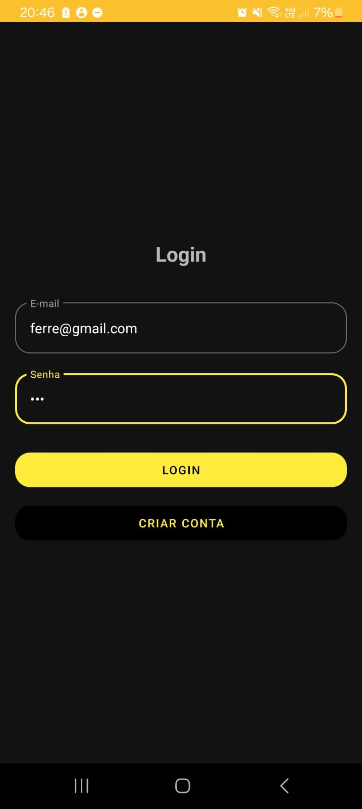
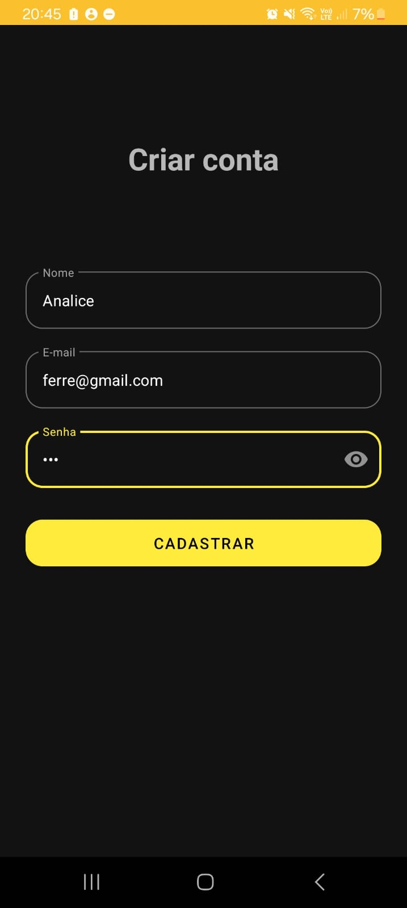
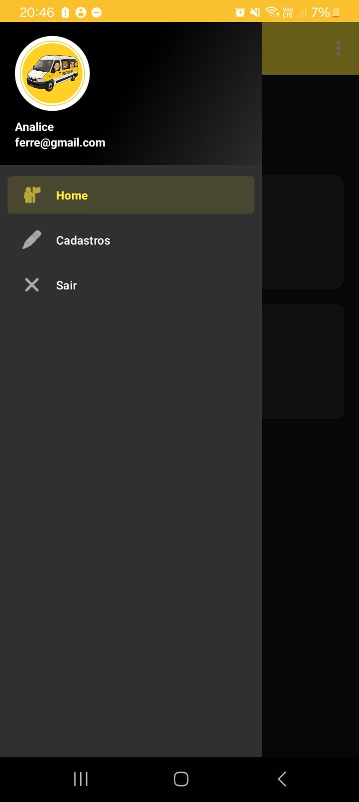
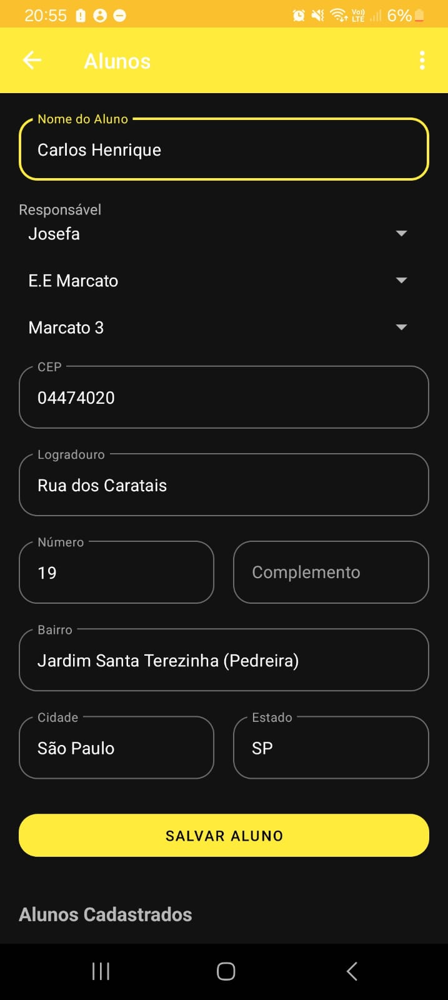
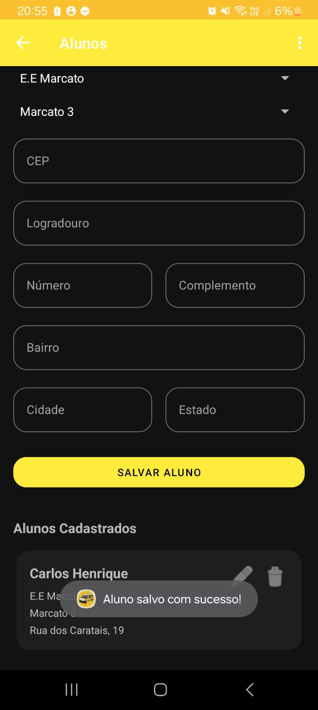
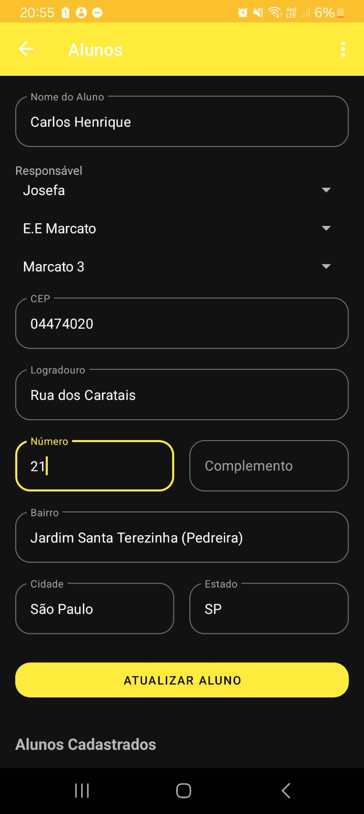
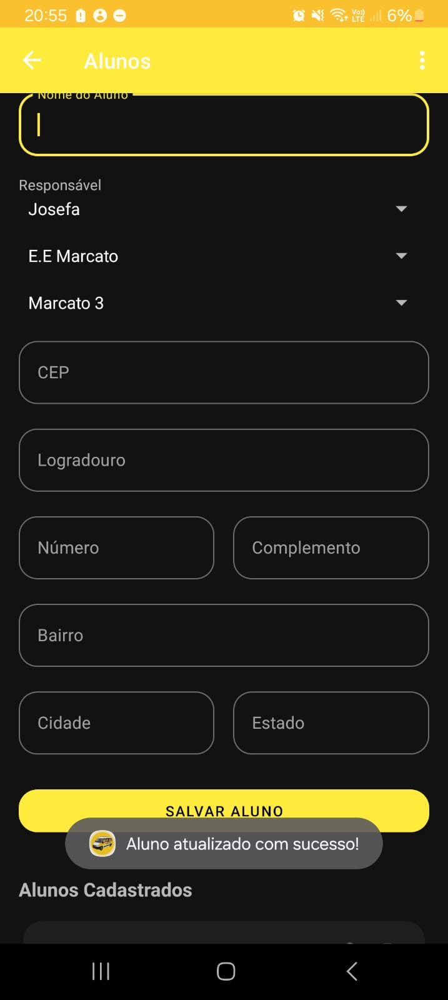

# Tio da Perua - Gestão de Transporte Escolar

## 1. Descrição do App

O **Tio da Perua** é um aplicativo Android focado em simplificar a rotina de motoristas e empresas de transporte escolar. Ele atua como uma central de gerenciamento, permitindo o cadastro e a organização de todas as informações essenciais para a operação, como alunos, responsáveis, escolas, turmas e condutores.

O principal objetivo do projeto é oferecer uma ferramenta robusta e intuitiva, que automatiza tarefas repetitivas (como o preenchimento de endereços) e centraliza os dados, garantindo mais agilidade e segurança para o negócio.

## 2. Telas Principais

### Fluxo de Autenticação e Navegação
| Login | Criar Conta |
| :---: | :---: |
|  |  |
| **Menu Principal** | **Tela de Cadastros** |
|  |  |

### Fluxo de Gerenciamento de Alunos
| Formulário de Aluno | Aluno Cadastrado |
| :---: | :---: |
|  |  |
| **Atualização de Aluno** | **Aluno Atualizado** |
|  |  |

## 3. Tecnologias Utilizadas

Este projeto foi construído utilizando tecnologias modernas do ecossistema Android:

*   **Linguagem:** [Kotlin](https://kotlinlang.org/)
*   **Arquitetura:** Single-Activity com Navigation Component, utilizando Fragments para cada tela.
*   **Banco de Dados:** [Room Persistence Library](https://developer.android.com/training/data-storage/room) para persistência de dados local, garantindo funcionamento offline.
*   **Assincronismo:** [Kotlin Coroutines](https://kotlinlang.org/docs/coroutines-overview.html) para gerenciar operações em segundo plano, como acesso ao banco de dados.
*   **UI (Interface de Usuário):**
    *   [Material Components](https://material.io/develop/android/docs/getting-started) para um design moderno e consistente.
    *   [View Binding](https://developer.android.com/topic/libraries/view-binding) para interagir com os layouts de forma segura.
    *   `RecyclerView` para exibir listas de dados de forma otimizada.
*   **Rede:**
    *   [Retrofit](https://square.github.io/retrofit/) para realizar chamadas HTTP à API.
    *   [Gson](https://github.com/google/gson) para converter objetos JSON.

## 4. Passo a Passo para Instalar e Rodar

1.  **Clonar o Repositório**
    
    ```sh
    git clone https://github.com/gabrielly-soares-marinho/Gerenciador_Perua_escolar.git
    ```

2.  **Abrir no Android Studio**
    *   Abra o Android Studio.
    *   Selecione `File > Open` e navegue até a pasta onde o projeto foi clonado.
3.  
**Sincronizar o Gradle**
    *   Aguarde o Android Studio sincronizar e baixar todas as dependências listadas no arquivo `build.gradle.kts`.
4.  **Executar o App**
    *   Clique no botão **Run (▶)** para instalar e executar o aplicativo em um emulador ou dispositivo físico conectado.

## 5. Endpoints da API

O aplicativo consome a API pública **ViaCEP** para a funcionalidade de preenchimento automático de endereço.

*   **Endpoint:** `GET https://viacep.com.br/ws/{cep}/json/`
*   **Descrição:** Retorna os dados de endereço correspondentes a um CEP informado.

## 6. Como o CRUD Funciona

O sistema implementa as operações de **C**reate, **R**ead, **U**pdate e **D**elete para todas as entidades principais através de uma interface gráfica intuitiva, com o banco de dados Room atuando como camada de persistência.

*   **Create (Criar):** O usuário preenche um formulário e clica no botão "Salvar". Os dados são validados e inseridos em sua respectiva tabela no banco de dados.
*   **Read (Ler):** Os dados cadastrados são exibidos em listas (`RecyclerView`) em suas respectivas telas. O aplicativo utiliza o padrão `Flow` do Kotlin para observar o banco de dados e atualizar a interface automaticamente sempre que um dado muda.
*   **Update (Atualizar):** Ao clicar no ícone de edição (lápis) de um item da lista, o formulário é preenchido com os dados existentes. Após a edição, o usuário clica em "Atualizar", e o registro correspondente é atualizado no banco de dados.
*   **Delete (Deletar):** Ao clicar no ícone de exclusão (lixeira), uma caixa de diálogo é exibida para confirmar a ação. Se confirmada, o registro é removido do banco de dados.

## 7. Funções do App

### Implementadas

- [✔] Sistema de autenticação para o gestor (Tio da Perua).
- [✔] CRUD completo para Alunos, Responsáveis, Escolas, Turmas e Condutores.
- [✔] Preenchimento automático de endereço via CEP em todos os formulários.
- [✔] Associação de Alunos a Responsáveis, Escolas e Turmas através de menus de seleção.
- [✔] Preenchimento automático do endereço do Aluno com base no Responsável selecionado.
- [✔] Preenchimento automático do endereço da Turma com base na Escola selecionada.
- [✔] Interface consistente com Material Design e cantos arredondados.

## 8. Autores e Contato

*   **Analice Ferreira Gomes**
    *   RA: 2404038
    *   Email: analice.gomes@aluno.faculdadeimpacta.com.br
*   **Emilly Silva Eduardo Pereira**
    *   RA: 2403751
    *   Email: emilly.pereira@aluno.faculdadeimpacta.com.br
*   **Gabrielly Soares Marinho**
    *   RA: 2403430
    *   Email: gabrielly.marinho@aluno.faculdadeimpacta.com.br
*   **Maurício Monteiro Filho**
    *   RA: 2302967
    *   Email: mauricio.monteiro@aluno.faculdadeimpacta.com.br
